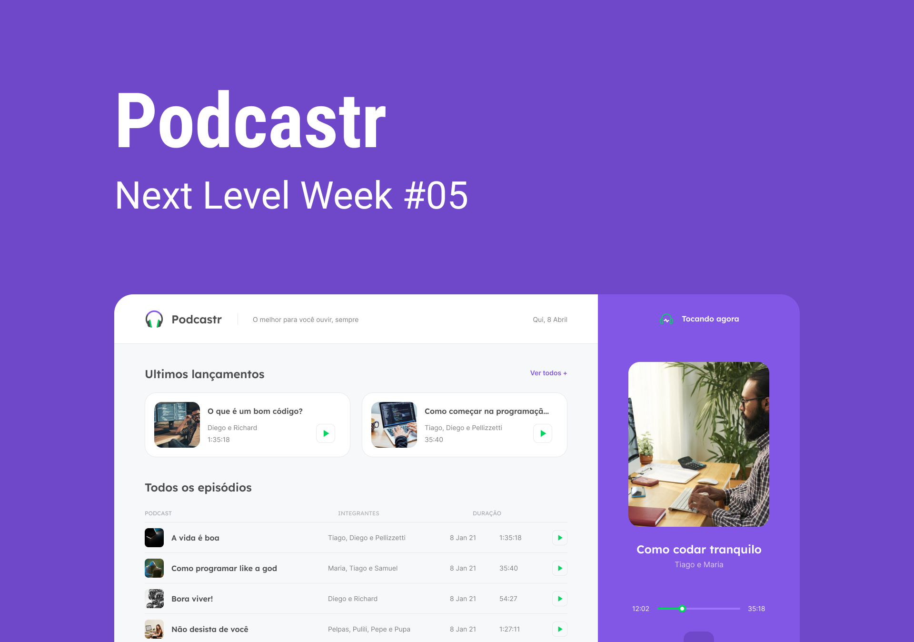

  

<h1 align="center">
  
  
  
  
  
</h1>
 

## 📝 Descrição

Projeto de criação de um site de podcast desenvolvido na Next Level Week #5 promovida pela [RocketSeat](https://www.rocketseat.com.br/).

 

## 🖌 Layout

  

Para conhecer o layout do projeto acesse o link abaixo. 

[Podcastr - Figma](https://www.figma.com/file/rlhpgxYk0kOdDFYOpOp6rp/Podcastr?node-id=160%3A2761)

 

## 👩‍💼 Autora

<b>Nádia Ligia, budding back-end developer.</b>

&nbsp;
&nbsp;

